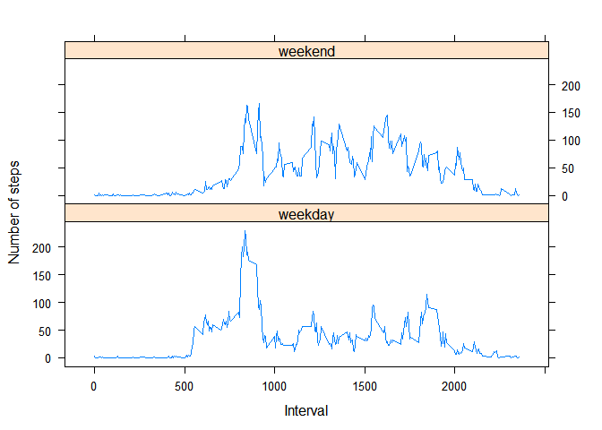

# Reproducible Research: Peer Assessment 1

## Loading and preprocessing the data


```r
unzip("activity.zip")
activity <- read.csv("activity.csv")
activity$date<-as.Date(activity$date,"%Y-%m-%d")
```

## What is mean total number of steps taken per day?
* Calculate the total number of steps taken per day


```r
dailysteps <- aggregate(steps ~ date, data = activity, FUN = sum, na.rm = TRUE)
head(dailysteps)
```

```
##         date steps
## 1 2012-10-02   126
## 2 2012-10-03 11352
## 3 2012-10-04 12116
## 4 2012-10-05 13294
## 5 2012-10-06 15420
## 6 2012-10-07 11015
```

* Make a histogram of the total number of steps taken each day


```r
hist(dailysteps$steps,xlab="Steps taken each day")
```

<!-- -->

* Calculate and report the mean and median of the total number of steps taken per day


```r
mean(dailysteps$steps)
```

```
## [1] 10766.19
```

```r
median(dailysteps$steps)
```

```
## [1] 10765
```

## What is the average daily activity pattern?
1.Make a time series plot (i.e. type = "l") of the 5-minute interval (x-axis) and the average number of steps taken, averaged across all days (y-axis)


```r
averageSteps <- aggregate(steps ~ interval, data = activity, FUN = mean, na.rm = TRUE)
plot(averageSteps, type="l")
```

<!-- -->

2.Which 5-minute interval, on average across all the days in the dataset, contains the maximum number of steps?


```r
averageSteps$interval[which.max(averageSteps$steps)]
```

```
## [1] 835
```


## Imputing missing values
* Calculate and report the total number of missing values in the dataset


```r
sum(is.na(activity))
```

```
## [1] 2304
```

* Devise a strategy for filling in all of the missing values in the dataset.

We will use the mean for a given 5-minute interval to fill in the missing values in *steps* variable

* Create a new dataset that is equal to the original dataset but with the missing data filled in.


```r
filled <- merge(activity,averageSteps,by="interval")
filled$steps.x[is.na(filled$steps.x)] <- filled$steps.y[is.na(filled$steps.x)]
filled_steps <- aggregate(steps.x ~ date, data = filled, FUN = sum)
```
* Make a histogram of the total number of steps taken each day. Calculate and report the mean and median total number of steps taken per day. 


```r
hist(filled_steps$steps.x,xlab="Steps taken each day")
```

<!-- -->

```r
mean(filled_steps$steps.x)
```

```
## [1] 10766.19
```

```r
median(filled_steps$steps.x)
```

```
## [1] 10766.19
```

* Do these values differ from the estimates from the first part of the assignment? What is the impact of imputing missing data on the estimates of the total daily number of steps?

The meadian total steps taken each day is changed a little, and is equal to mean now. But overall compared to previous results the impact of imputting is very small.

## Are there differences in activity patterns between weekdays and weekends?
1.Create a new factor variable in the dataset with two levels - "weekday" and "weekend" indicating whether a given date is a weekday or weekend day.


```r
filled$day <- factor((weekdays(filled$date) %in% c('Saturday','Sunday')), levels=c(FALSE, TRUE), labels=c('weekday', 'weekend'))
```

2.Make a panel plot containing a time series plot (i.e. type = "l") of the 5-minute interval (x-axis) and the average number of steps taken, averaged across all weekday days or weekend days (y-axis).


```r
averageSteps_wk <- aggregate (steps.x ~ interval + day, data = filled, FUN = mean)
library(lattice)
xyplot(steps.x~interval|day, data = averageSteps_wk, type="l",layout = c(1, 2),ylab="Number of steps",xlab="Interval")
```

<!-- -->
